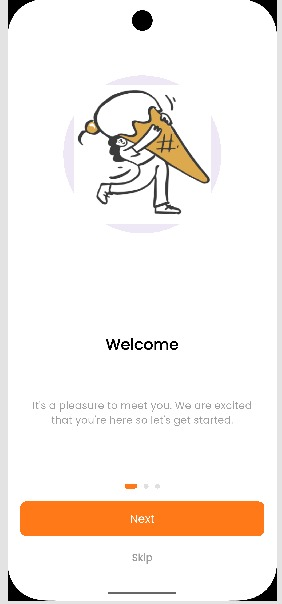
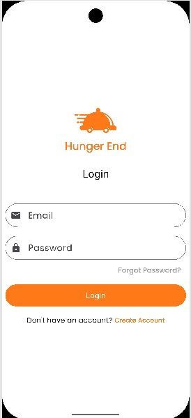
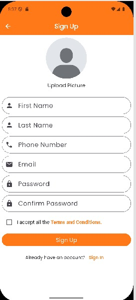
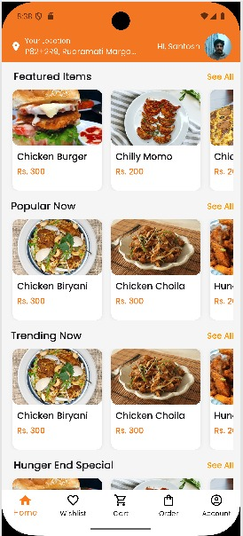
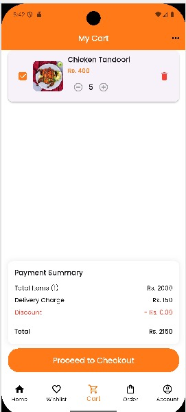
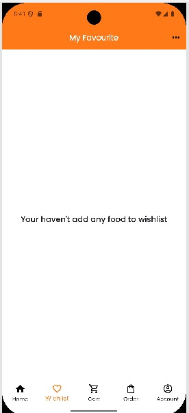
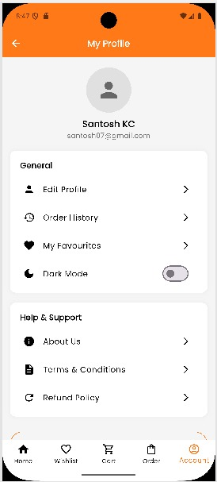
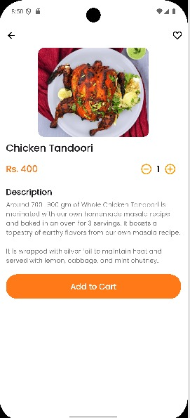
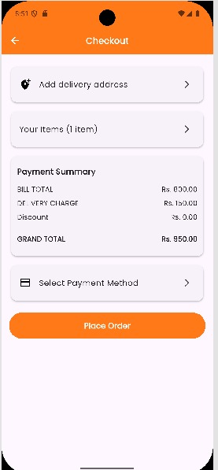
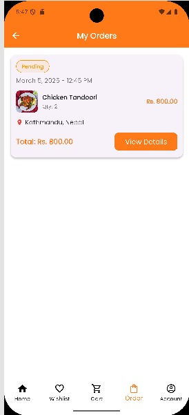

# 🍽️ Hunger End – Food Delivery App  

## 📌 Overview  
Hunger End is a **Flutter-based food delivery app** designed for a single restaurant. It provides a seamless experience for customers to browse the menu, place orders, track deliveries, and manage their profiles. The app uses **Hive Database** for local storage and **Node.js APIs** for backend communication.  

## ✨ Features  
✔️ **User-friendly UI** for smooth navigation  
✔️ **Food ordering & checkout** with multiple payment options  
✔️ **Order tracking** to monitor delivery status  
✔️ **Secure login & authentication**  
✔️ **BLoC state management** for efficient data handling  
✔️ **Local & remote data storage**  

## 🛠️ Tech Stack  
- **Frontend:** Flutter (Dart)  
- **Backend:** Node.js (RESTful APIs)  
- **Database:** Hive (Local) & API-based data handling  
- **State Management:** BLoC 

### 🏁 Onboarding Screens  
  
 

### 🔐 Authentication Screens  
  
  

### 🍔 Main Screens  
  
  
 
 
 

### 📦 Order Management  
  

